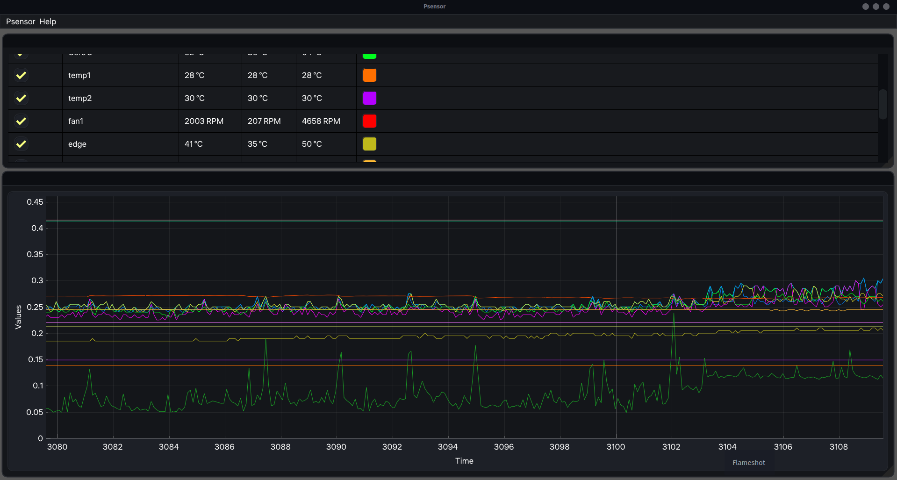
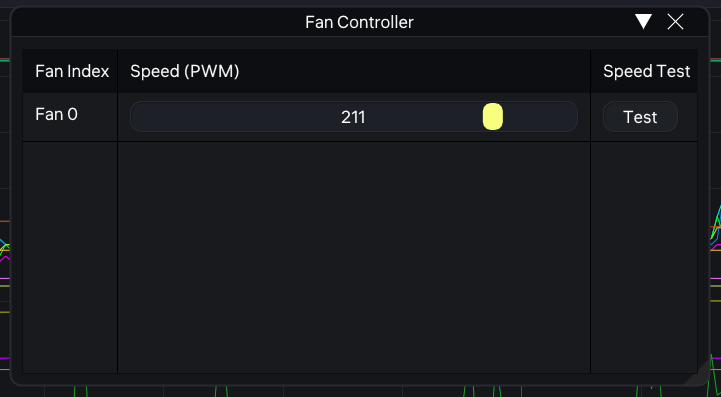

# PSensor

Psensor is a graphical hardware monitoring application for Linux.


### It draws realtime charts and raises alerts about:
* the temperature of the motherboard and CPU sensors (using lm-sensors).
* the temperature of the NVidia GPUs (using XNVCtrl).
* the temperature of ATI GPUs (using ATI ADL SDK).
* the temperature of the Hard Disk Drives (using hddtemp, libatasmart or udisks2).
* the rotation speed of the fans.
* the temperature of a remote computer.
* the CPU load.

### Alerts are using Desktop Notification and a specific GTK+ status icon.

> [!NOTE]
> For Ubuntu users, Psensor is providing an Application Indicator which turns red under alert and a menu for quickly check all sensors.
>
> A new feature of PSensor is to allow manual fan speed controlling by writing PWM values to the pwm controllers
> each asociated to the certain fan managed by the kernel.
> ### This only works with 4 pin based cooling fans!!!
>
> It relies on a simple user interface that lists all available cooling fans inside your computer.

### Components:
- [Core library](src/lib/README.md)
- [New Desktop GUI](src/new-gui/)
- [GUI Utility (Old)](src/GUI/README.md)
- [Web Server (Old)](src/server/README.md)


# Building from source


## Installation requirements:

- [Xmake](https://xmake.io/guide/quick-start.html)

### Dependencies
```
json-c
glib-2.0
libgtop-2.0
gio-unix-2.0
udisks2
libatasmart
X11
libkmod
```

### Build Commands

also check out build configuration for specific fatures:
`xmake f --menu` then enter Project Configuartion

then build:
`xmake`

> [!NOTE]
> The GTK based desktop GUI will be removed in the future due to old unmaintained dependencies and code bloatware.
> 
> New GUI is currently located in `src/new-gui/` and it will serve as the official desktop application of psensor fork
> 
> Same goes for the old web server which is currently very unsafe to use in terms of security.
 
 
# Feature progress
 
- 🔽 Core library
    - ✔️ Sensor reading
    - ✔️ JSON Output of sensor values
    - 🔽 Fan controller (!!! WARNING !!! It may not work correctly for any hardware. Be cautious when using it as it can cause GPU / CPU overheating)
        - ✔️ manual speed control
        - ❌ automatic speed control
        - ✔️ speed test
        - ⚠️ Kernel module management
        - 🔽 OEM Compatibility
            - ❌ Dell
            - ❌ Lenovo Thinkpad
    - 🔽 Hardware Providers
        - lm-sensors
        - ✔️ NVIDIA
        - ✔️ Broadcom BCM2835
        - ❌ Broadcom BCM2712
        - ✔️ AMD
        - 🔽 gtop2
             - ✔️ CPU Usage
             - ✔️ Free Memory
             - ❌ Memory Usage
             - ❌ Network Usage / traffic
             - ❌ Individual Core Usage
             - ❌ Cache Usage
        - ✔️ udisks2
        - ✔️ hddtemp
        - ✔️ atasmart
        - ❌ IPMI
   
    - ❌ Sensor recording
        - Formats
            - ❌ JSON
            - ❌ CSV
            - ❌ [BSV (Experimental)](https://github.com/Stenway/BSV-Challenge)
    
- 🔽 Desktop GUI
    - 🔽 Easy to use UI
        - ✔️ Autosave window / table layouts
        - ❌ Custom theme support
        - ❌ Custom font support
    - 🔽 Fan controller table
        - ❌ User created presets for fan speeds
        - ✔️ User controlled fan speeds
        - ✔️ Fan speed history
    - 🔽 Sensor plots
        - ✔️ Custom plot history
        - ✔️ Custom time interval
        - ✔️ Sensor list
        - ✔️ Sensor list refresh
        - ❌ Sensor record viewer
    - ✔️ Individual sensor preferences
    - ❌ Custom toast message boxes
    - ❌ Custom UI theme support
    - ✔️ Configuration
    
- 🔽 Server
    - ❌ User Auth via SSH protocol
    
- 🔽 Web Interface
    - ❌ Automatic page opening
    - ❌ User Auth page
    - ❌ Sensor plots
        - ❌ Custom time span
        - ❌ Custom time interval
        - ❌ Sensor list
        - ❌ Sensor record viewer
    - ❌ Individual sensor preferences
    - ❌ Fan controller table
    - ❌ Multiple server connections
    - ❌ Settings
    - ❌ Dark mode / Light mode
    - ❌ Save UI layouts
    - ❌ Save previous connected server users
    

> [!NOTE]
> On wayland when running with sudo psensor-ui can fail with `ERROR new-gui/ui_entry.cpp:168: Error: SDL_Init(): No available video device`
> 
> To fix this simply pass the -E flag to sudo : `sudo -E psensor-ui`
> 
> This preserves the environment variables
    
    
# Screenshots

